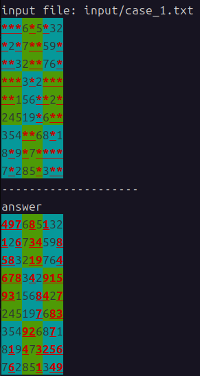

# sudoku solver

## 概要
このツールは数独ソルバーです。以下のような内容のファイルを用意してこのプログラムを実行すると答えが出力されます
``` input.txt
***6*5*32
*2*7**59*
**32**76*
***3*2***
**156**2*
24519*6**
354**68*1
8*9*7****
7*285*3**
```

## 実行方法
```
cargo run -- <file_name>
```

## 例
サンプル問題が`input/case_1.txt`に入っています。以下のコマンドでその問題の解答が出力されます
```
cargo run -- input/case_1.txt
```

